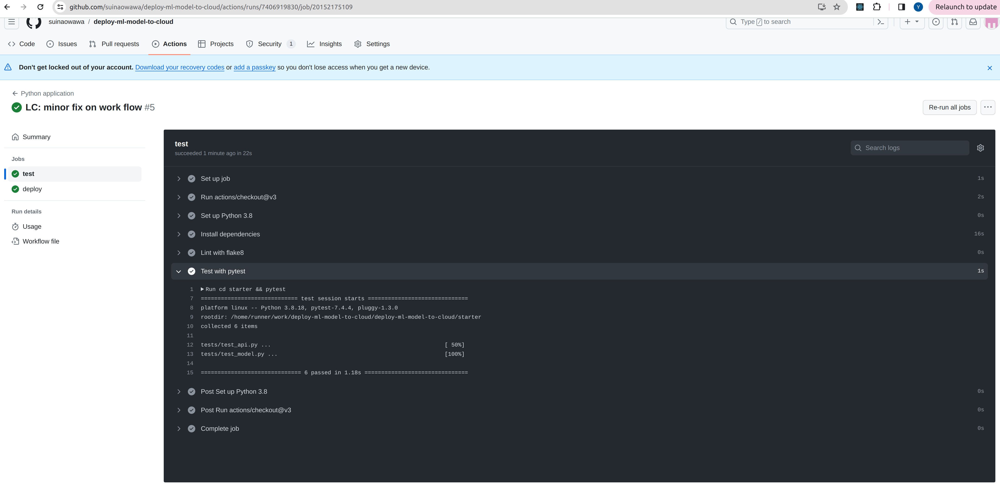
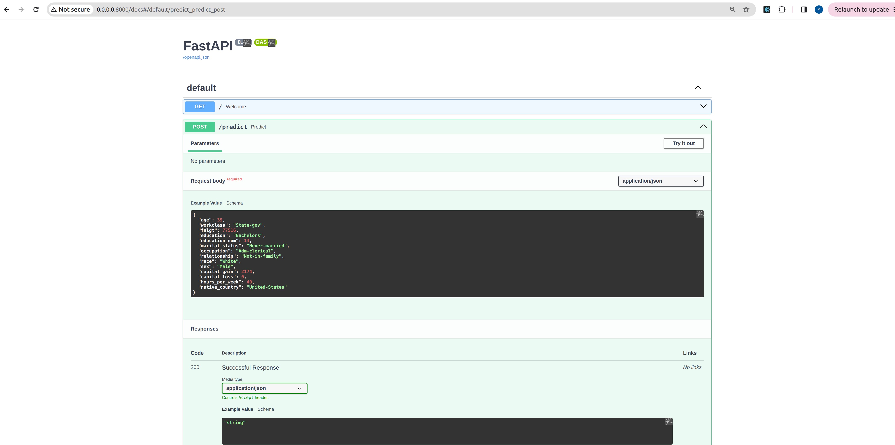
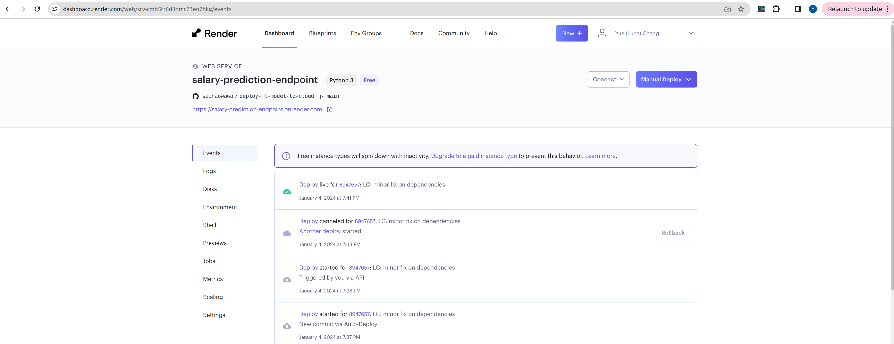
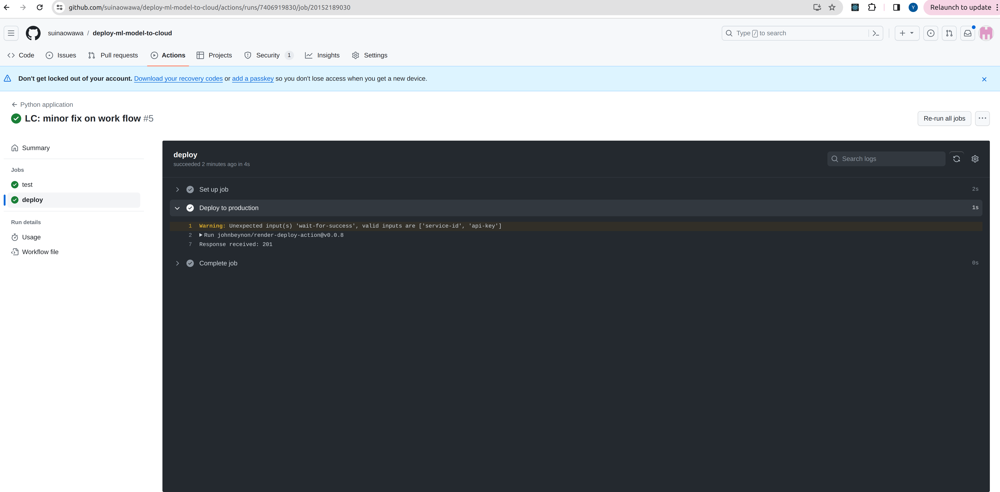
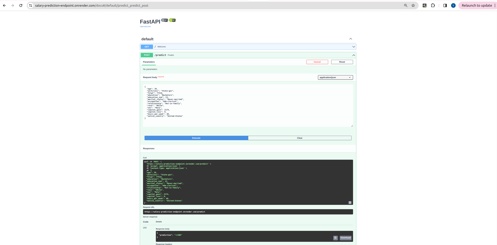

# Project: Deploying a Machine Learning Model with FastAPI

This is a project from Udacity's Machine Learning DevOps Engineer Nanodegree.

## Project Overview

In this project you will develop a classification model on publicly available [Census Bureau data](https://archive.ics.uci.edu/ml/datasets/census+income). You will create unit tests to monitor the model performance on various data slices. Then, you will deploy your model using the FastAPI package and create API tests. The slice validation and the API tests will be incorporated into a CI/CD framework using GitHub Actions.

## Project Process

### Environment Set up
* Download and install conda if you don’t have it already.
    * Use the supplied requirements file to create a new environment, or
    * conda create -n [envname] "python=3.8" scikit-learn pandas numpy pytest jupyter jupyterlab fastapi uvicorn -c conda-forge
    * Install git either through conda (“conda install git”) or through your CLI, e.g. sudo apt-get git.

### Setup Repositories
* Create a directory for the project and initialize git.
    * As you work on the code, continually commit changes. Trained models you want to use in production must be committed to GitHub.
* Connect your local git repo to GitHub.
* Setup GitHub Actions on your repo. You can use one of the pre-made GitHub Actions if at a minimum it runs pytest and flake8 on push and requires both to pass without error.
    * Make sure you set up the GitHub Action to have the same version of Python as you used in development.

- A working CI pipeline is shown below:

### Data
* Download census.csv and commit it to dvc.
* This data is messy, try to open it in pandas and see what you get.
* To clean it, use your favorite text editor to remove all spaces.

### Model
* Write a machine learning model that trains on the clean data and saves the model.
* Write unit tests for at least 3 functions in the model code.
* Write a function that outputs the performance of the model on slices of the data.
    * Suggestion: for simplicity, the function can just output the performance on slices of just the categorical features.
* Write a model card using the provided template.

### API Creation
*  Create a RESTful API using FastAPI this must implement:
    * GET on the root giving a welcome message.
    * POST that does model inference.
    * Type hinting must be used.
    * Use a Pydantic model to ingest the body from POST. This model should contain an example.
   	 * Hint: the data has names with hyphens and Python does not allow those as variable names. Do not modify the column names in the csv and instead use the functionality of FastAPI/Pydantic/etc to deal with this.
* Write 3 unit tests to test the API (one for the GET and two for POST, one that tests each prediction).

- Here is the created API:

### API Deployment
* Create a free Render account.
* Create a new app and have it deployed from your GitHub repository.
    * Enable automatic deployments that only deploy if your continuous integration passes.
    * Hint: think about how paths will differ in your local environment vs. on Render.
    * Hint: development in Python is fast! But how fast you can iterate slows down if you rely on your CI/CD to fail before fixing an issue. I like to run flake8 locally before I commit changes.
* Write a script that uses the requests module to do one POST on your live API.

- Created Render APP from repo:

- The CD pipeline for Render Deployment:

- Request live deployed API:
